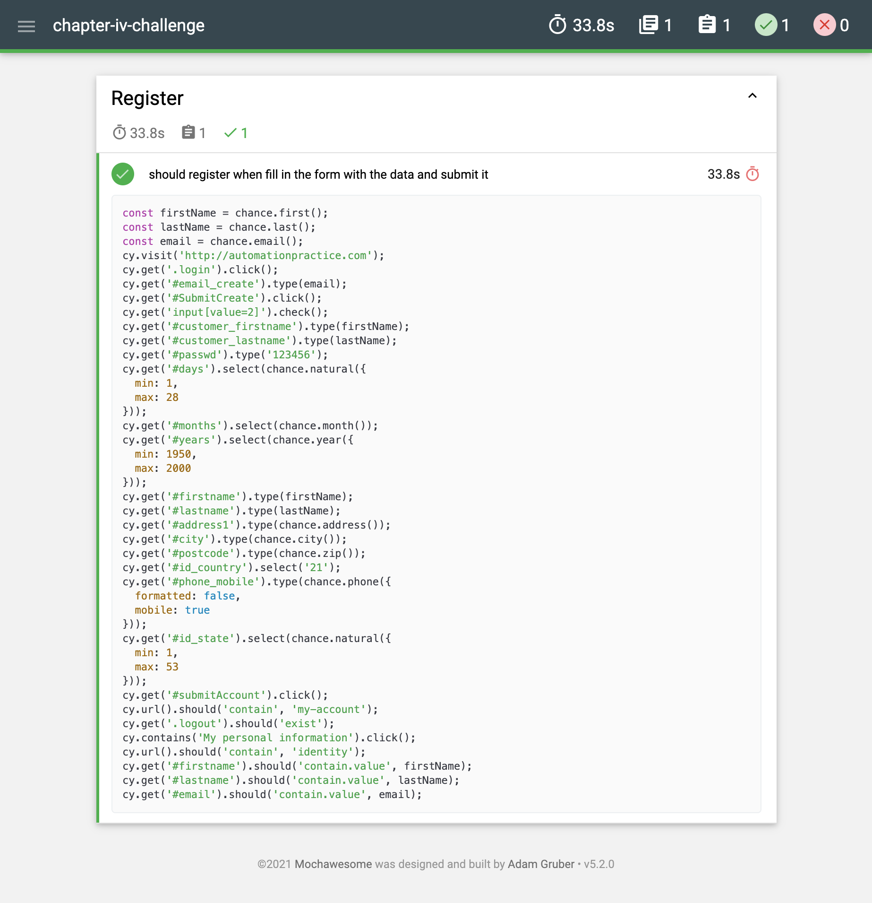

# ⚡️ Chapter IV - Challenge 02

Cypress automation testing of an [e-commerce](http://automationpractice.com) website.

## 📝 Requirements

- register a new user to the website
- user data should be different for each testing
- add assertions to the tests
- generate reports using [mochawesome](https://github.com/adamgruber/mochawesome)
- create a new repository to Github
- describe the project in a README file
- run tests in Github Actions
- report deployment at Github Pages

## ⚙️ Setup Project

Init a new Node.js project:

```bash
  npm init -y
```

Install Cypress as dev dependency:

```bash
  npm install cypress -D
```

Run Cypress:

```bash
  npx cypress open
```

Delete boilerplate files and add a schema to the `cypress.json` file:

```json
{
  "$schema": "https://on.cypress.io/cypress.schema.json"
}
```

Install Chance as dev dependency:

```bash
  npm install chance -D
```

Create a new test file `register.spec.js` to test the registration process.

Add scripts commands to the `package.json` file:

```json
{
  "scripts": {
    "cy:open": "npx cypress open",
    "cy:run": "npx cypress run"
  }
}
```

## 🎥 Test the registration process

Run the browser test:

```bash
  npm run cy:open
```

Or run the headless test to record the video:

```bash
  npm run cy:run
```


## ✅ Generate Reports

Install Mochawesome as dev dependency:

```bash
npm install cypress-multi-reporters mochawesome mochawesome-merge mochawesome-report-generator -D
```

Add reporter configuration to the `cypress.json` file:

```json
{
  "$schema": "https://on.cypress.io/cypress.schema.json",
  "videoCompression": 32,
  "reporter": "cypress-multi-reporters",
  "reporterOptions": {
    "configFile": "reporter-config.json"
  }
}
```

Add a new reporter configuration file `reporter-config.json`:

```json
{
  "reporterEnabled": "mochawesome",
  "mochawesomeReporterOptions": {
    "reportDir": "mochawesome-report",
    "quiet": true,
    "overwrite": false,
    "html": false,
    "json": true
  }
}
```

Add `rimraf` as dev dependency:

```bash
npm install -D rimraf
```

Add scripts commands to the `package.json` file:

```json
{
  "scripts": {
    "cy:open": "npx cypress open",
    "cy:run": "npx cypress run",
    "report:merge": "mochawesome-merge > index.json",
    "report:mocha": "marge index.json",
    "report:clean": "rimraf mochawesome-report index.json"
  }
}
```

Generate the report:

```bash
npm run cy:run && npm run report:merge && npm run report:mocha
```

Check the report at `mochawesome-report/index.html`:



To clean the report:

```bash
npm run report:clean
```

## 🚀 Github Actions and Github Pages

- Add the Node.js project to the `.github/workflows/main.yml` file.
- Install dependencies
- Run the headless test
- Generate the report
- Deploy the report to Github Pages: https://cintiafumi.github.io/agilizei-chapter-iv-challenge/
